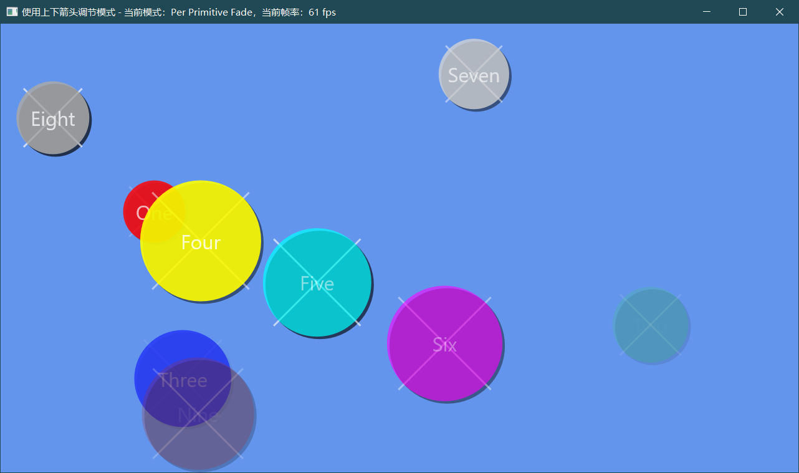
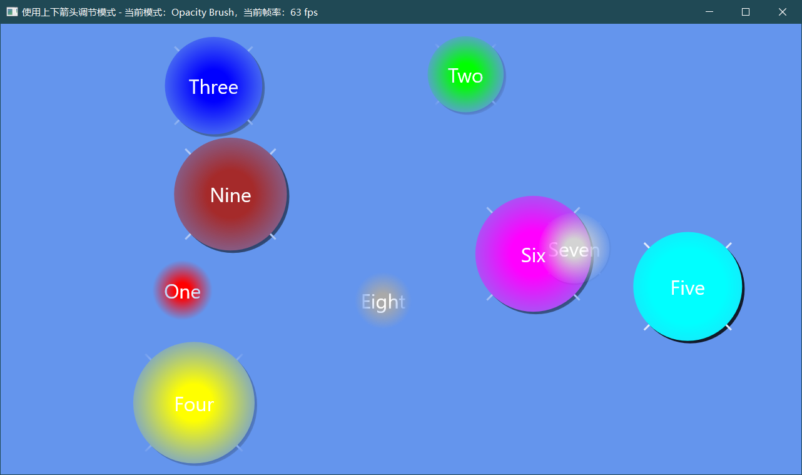

# Win2D-Samples-Simulation
使用Win32 API来编写Direct2D程序，模仿Win2D官方给出的示例程序，不定期更新。

## 一、Layers
模仿示例当中的Layers功能，使用上下箭头可以切换四种分层模式，这四种模式由枚举 `LAYER_MODE` 来定义。

``` cpp
enum class LAYER_MODE : DWORD
{
	LAYER_FADE,
	PER_PRIMITIVE_FADE,
	OPACITY_BRUSH,
	CLIP_GEOMETRY
};
```


### 1、PerPrimitiveFade效果图



### 2、OpacityBrush效果图


